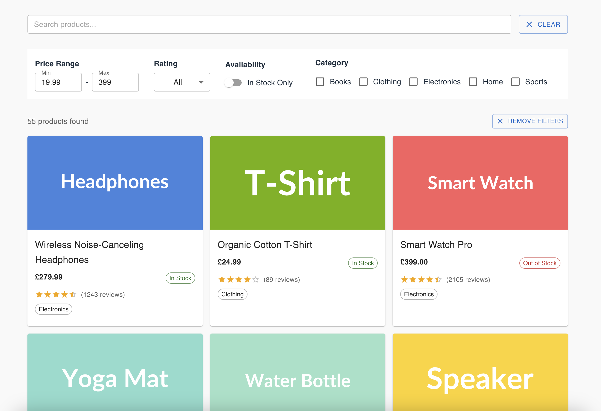
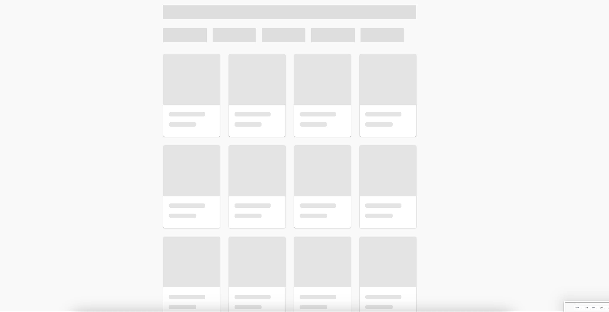
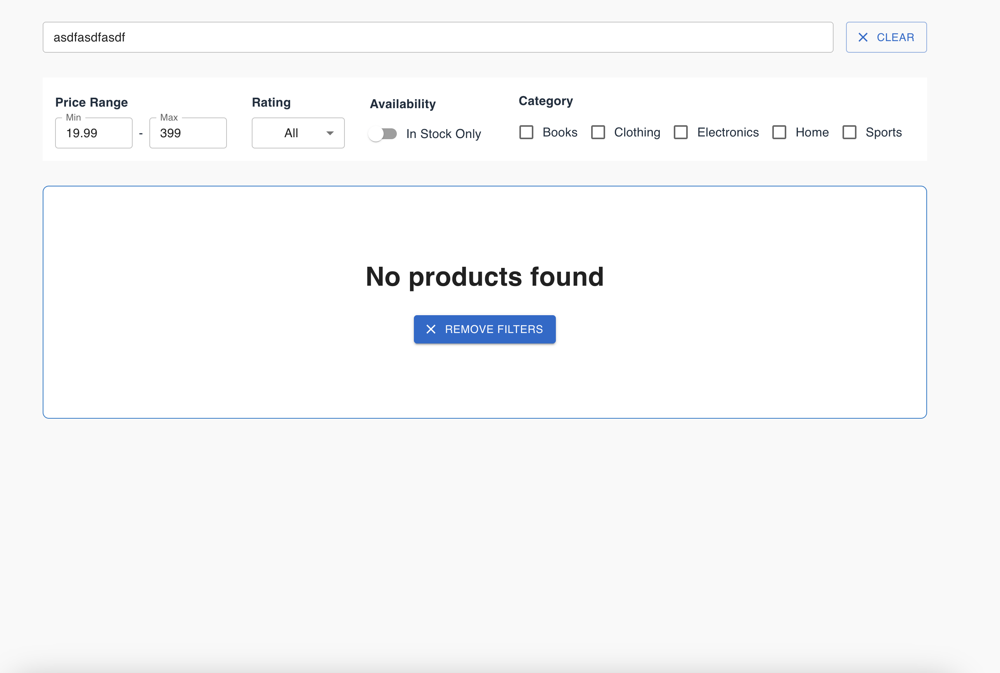
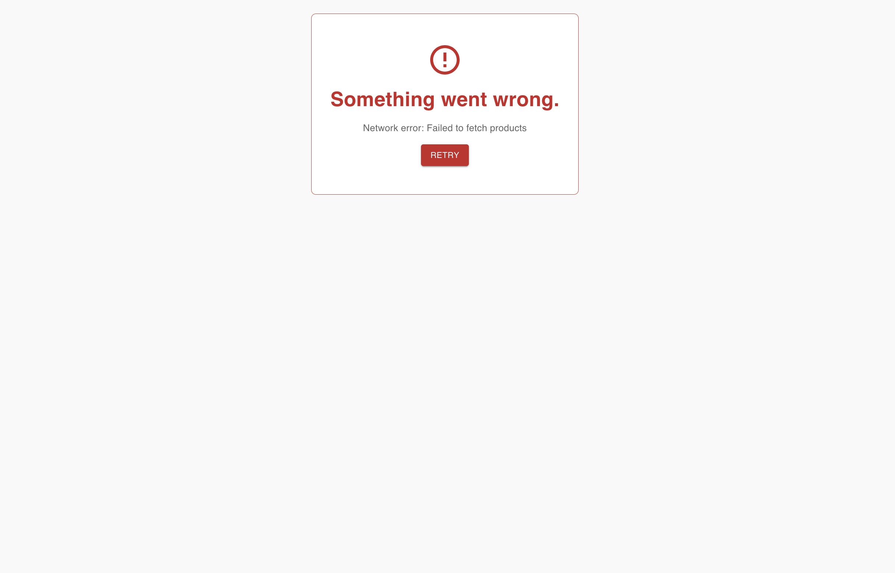

# Product Catalog Demo

A responsive **Product Search & Filter Interface** built in **React** using **MUI**.

It's hosted on vercel at: [product-search-and-filter.vercel.app](https://product-search-and-filter.vercel.app/)

This project fetches product data from a simulated API (`ProductAPI`) and provides search and filter functionality including price range, categories, ratings, and stock availability.

---

## Core Requirements

1. **Display Products**
   - Show all products in a **grid layout**.
   - Each product card displays:
     - Product image
     - Name
     - Price (formatted as currency)
     - Rating (visual representation)
     - Stock status
     - Number of reviews

2. **Search Functionality**
   - Real-time search as the user types.
   - Search checks product names.
   - Debouncing implemented (minimum 300ms).
   - Clear search button included.

3. **Filter Options**
   - Price Range: Min and max price inputs/slider.
   - Categories: Multi-select checkboxes.
   - Rating: Minimum rating filter (e.g., "4 stars & up").
   - Availability: "In Stock Only" toggle.

4. **User Experience**
   - Loading state shown while fetching products (using **MUI Skeletons**).
   - Errors handled gracefully (API has a 5% error rate).
   - Result count displayed.
   - "No results found" message shown when applicable.
   - Filters update results immediately.

---

## Project Structure

```
src/
├─ assets/
├─ components/
│ ├─ ErrorComponent.tsx
│ ├─ Filters.tsx
│ ├─ LoadingComponent.tsx
│ ├─ NoResultsFound.tsx
│ ├─ ProductCard.tsx
│ ├─ RangeSelector.tsx
│ ├─ SearchBar.tsx
│ ├─ SearchResults.tsx
│ ├─ SingleProductCard.tsx
├─ external-api/
│ ├─ product-api.js
│ ├─ products.json
├─ hooks/
│ ├─ useDebounce.ts
│ ├─ useFilteredProducts.ts
│ ├─ useProducts.ts
├─ types/
│ ├─ products.ts
├─ App.css
├─ App.tsx
├─ custom-typings.d.ts
├─ index.css
├─ main.tsx
```

---

## Getting Started

1. Clone the repo:

```bash
git clone <repo-url>
cd <repo-folder>
```

2. Install dependencies:

```bash
npm install
# or
yarn
```

3. Run locally:

```bash
npm start
# or
yarn start
```

4. Open in browser: http://localhost:5173/

## Usage

- Use the search bar to filter products by name.
- Adjust filters to narrow down results by price, category, rating, or stock.
- Skeleton loaders display while data is being fetched.
- If an API request fails, the error component shows the message with optional retry.

## Tech Stack

- React 18
- TypeScript
- MUI v5
- Custom Hooks for state & filtering logic (`useProducts`, `useFilteredProducts`)
- Simulated API with `ProductAPI` and JSON data

## Notes

- Filtering logic is centralized in a custom hook (`useFilteredProducts`) to keep the UI components clean.
- Loading skeletons make the app feel responsive even with artificial network delays.
- All icons and illustrations are from MUI; no external assets required.
- Designed for demo purposes; performance optimized with memoization and parallel fetching of filters.

## Demo

Below is a demonstration of the Product Filter App in various states.

### 1. Normal State

The app displays products in a grid layout with all details visible: image, name, price, rating, stock status, and number of reviews.



---

### 2. Loading State

While fetching data, skeleton loaders appear to indicate loading progress and keep the UI responsive.



---

### 3. Nothing Found State

If the search or filters return no results, the app displays a friendly "No products found" message.



---

### 4. Error State

If an API request fails, the error component shows the message with an optional retry button.


